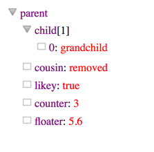

# An expanding object viewer for jquery

you can view an object like an expanding tree with expando.

```javascript
      $(document).ready(function() {

          var obj = {
              'parent' : {
                  'child': [
                      'grandchild'
                  ],
                  'cousin' : 'removed',
                  'likey' : true,
                  'counter' : 3,
                  'floater' : 5.6
                  
              }
          };
          
          $('#mygoodies').expando(obj);

      });
```

and define the target

```html
  <body>
    <div id="mygoodies"></div.
  </body>
```

which would look like




[Try Me !](https://eddo888.github.io/Expando/index.html)
